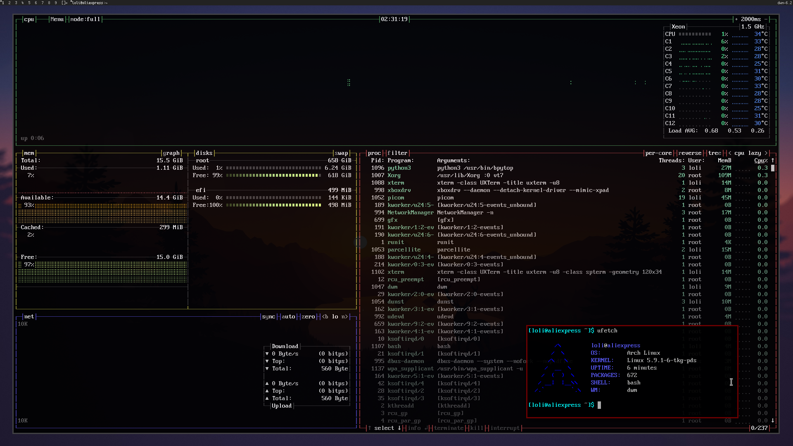

this script automatically configures an artix linux install from scratch with a basic dwm desktop

this is mainly to quickly put my personal config on a brand new install, USE AT YOUR OWN RISK and
don't blame me if it nukes your data

# usage
* boot into a live artix iso or any linux install that has pacman configured with artix repos and
  the arch bootstrap tools
* login with username root, password artix
* `curl -sSLO https://raw.githubusercontent.com/Francesco149/startix/master/startix.sh && sh ./startix.sh`
* follow instructions

you can also install from a different machine than the target, and it should work fine with EFI.
with BIOS you might need to still boot a live iso on the target machine to fix up the initramfs

# advanced usage
## custom partitoning
if you want a custom partitioning scheme, partition the drive beforehand and mount everything at
/mnt/artix . if /mnt/artix is mounted, the installer will skip the auto partitioning step

## environment variables
you can set any of these environment variables:

* `ARTIX_CACHE` the contents of this directory will be rsynced to the rootfs. mainly used to copy
  over a pacman cache and avoid redownloading
* `BIOS` (set to 1 or 0) can be used to force enable/disable legacy MBR install
* `ARTIX_USER` sets the user non-interactively (will still ask for password at the moment)
* `ARTIX_HOSTNAME` sets the hostname non-interactively
